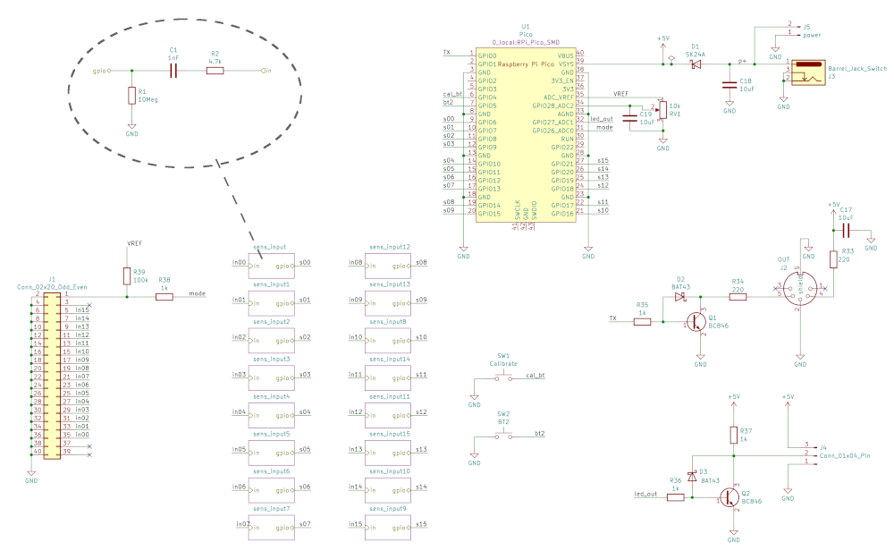

# MIDI Touch Keyboard

**Disclaimer**: this is a one-time personal hobby project. Shared as-is. Work
in progress. **Use at your own risk**, if at all.

This project is a device that lets you play MIDI synthesizer by touching
conducting surfaces, like fruits or vegetables.

It has 16 inputs (a bit over an octave), standard DIN-5 MIDI output and USB
MIDI interface. Additional controls include 'calibrate' button and a
'sensitivity' potentiometer.

A LED strip provides additional feedback displaying key state in piano-like layout.

## Working principle

Each 'input' is a simple capacitive sensor. Touching it either significantly
increases input capacitance or lowers its resistance to the device's ground. In
both cases this causes increase in the time constant of an RC circuit monitored
by a microcontroller.

The microcontroller charges the capacitance of the sensor circuit in short
intervals and checks if it discharges before a specific time. If it does, then
the input is open if it does not, it means the sensor has been touched.

The time to wait for discharging is determined through a calibration process
and the sensitivity potentiometer. The calibration process just measures the discharge times,
and collects maximum and minimum values measured, to roughly find the threshold
range. This assumes that at least one of the sensors has been touched during calibration.
Then the sensitivity knob can be used to set threshold within this range.

## Circuit design

The heart of the device is a Raspberry Pi Pico board. Cheap and powerful enough.

The sensor inputs are built using two resistors and a capacitor connected do
the microcontroller general-purpose IO pins. Values of those components has
been chosen experimentally to get quick and precise-enough measurements.

One pin is used to drive MIDI output. That is a standard circuit from the MIDI
1.0 specification using a transistor as the current loop switch (with a
Schottky diode for sharper edges).

Another pin drives addressable LED strip (WS2812B). Again, a transistor with a
Schottky diode is used to drive 5V data line here.

Two pins are used for button (actually only one used at the moment).

One ADC pin is connected to the sensitivity potentiometer. Another ADC pin is
connected to the sensors connector, so it can be used for detection of a device
connected there (in case I make one).

There is also an additional DC input, in case the micro-USB on the Pico is not
enough, because why not.

## Hardware realization

The device has been built on a single 'DIY' double-sided PCB, manufactured on a
small CNC engraver. Brass rivets are used for vias, otherwise no holes are
copper-plated. Most elements are surface mounted, 0603 size. The Raspberry Pi
Pico board is also surface-soldered to the main PCB, to keep overall low
profile (which the MIDI jack breaks anyway).

Sensor inputs are available via an angled 2x20 pin connector (like for an
old-style IDE HDD ribbon). Lower pins are all ground, sensors are on the upper
pins, starting from the third one. The last upper pin measures resistance to
the ground, for some auto-configuration capability in the future (not used now).

PCB layout is designed for my DIY constraints and the way I imagined the
complete device and is not suitable for most other fabrication processes.

The PCB design from KiCAD has been exported to Gerber files which would first
be converted to gcode by [pcb2gcode](https://github.com/pcb2gcode/pcb2gcode)
and then that gcode would be further processed by my
[postprocess.py](kicad/postprocess.py) script, for easier use with
[bCNC](https://github.com/vlachoudis/bCNC). Then couple of attempts and many
hours with the CNC machine and the PCB was ready for soldering. No soldermask,
unfortunately.

Even without the soldermask and with the small SMD components soldering was not
very hard. There was just a couple places that needed a do-over and proper
cleanup (the sensor circuit is quite sensitive to bad isolation, as 10 megaohm
resistors are used there).

The holes were drilled a bit to shallow, but that was not hard to fix, either.

## Firmware

The firmware is written in Rust, using the marvelous
[Embassy](https://embassy.dev/) framework. Nothing fancy otherwise.

One CPU core is dedicated for reading the sensors and UI inputs and basic
key-on/key-off logic. The other core does MIDI I/O over serial and USB.
Components communicate by passing messages via Embassy channels.

The LED strip programming uses Raspberry Pi Pico's PIO (programmable I/O), so
no bit-banging in CPU time is needed.

